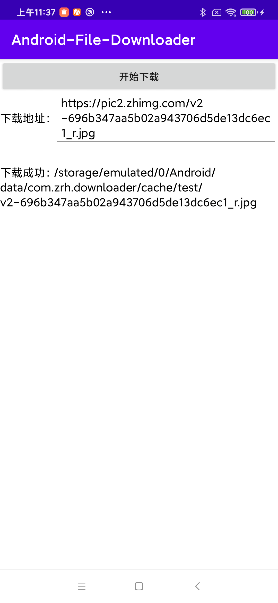
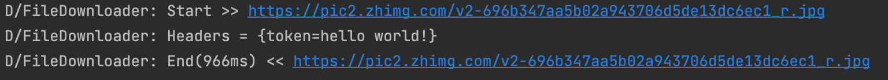

# Android-File-Downloader

Android轻量级文件下载框架，支持文件去重加载，支持进度监听，支持预加载。




### 使用步骤

#### 1.下载AAR并添加到项目中。

[下载地址](https://github.com/zrheasy/Android-File-Downloader/releases/download/v1.0.0/file-downloader-v1.0.aar)

```groovy
implementation fileTree(dir: 'libs', include: ['*.jar', '*.aar'])
```

#### 2.初始化FileDownloader。

```kotlin
FileDownloader.init(this, DownloadConfig())

// DownloadConfig可配置请求头和日志打印
setLogger { Log.d("FileDownloader", it) }
setHeaderProvider {
    mapOf<String, String>("token" to "hello world!")
}
```

#### 3.下载文件。

```kotlin
val downloadHandle = FileDownloader.download(url, outputDir, fileName, false)
// 设置下载监听
downloadHandle.setCallback(object : DownloadCallback {
    override fun onCompleted(file: File) {
        // handle completed
    }

    override fun onError(code: Int, msg: String) {
        // handle error
    }

    override fun onProgress(percent: Float) {
        // handle progress
    }
})

// 取消下载
downloadHandle.stop()
```